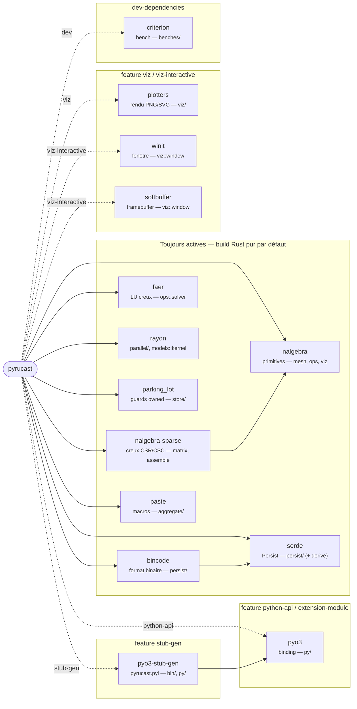

# Arborescence

La carte des sources : où vit chaque morceau. La règle d'or est la
**séparation conteneurs / opérateurs / binding** — les structures de données
(`containers/`) ne connaissent pas les opérateurs (`ops/`), et le binding
Python (`py/`) est un miroir 1:1 qui n'ajoute aucune logique.

```text
src/
├── lib.rs              # racine de la crate + #[pymodule] (enregistrement Python)
│
├── store.rs            # le store à handles : slots, générations, refcount, swap
├── persist.rs          # trait Persist (serde + bincode), format portable
├── error.rs            # PyrucastError + Result (l'unique type d'erreur)
├── dump.rs             # trait Dump (3ᵉ niveau d'affichage : contenu intégral)
├── aggregate.rs        # trait Aggregate + macros (len/[i]/union, pyméthodes)
│
├── containers/         # LES OBJETS (structures de données, aucune dépendance à ops/)
│   ├── mod.rs
│   ├── mesh/
│   │   ├── mod.rs          # Mesh, SubMesh
│   │   ├── coords.rs       # Coords (jeux de coordonnées, refcount par nœud)
│   │   ├── node.rs         # Node (accesseur RAII)
│   │   ├── cell.rs         # Cell (vue d'une cellule)
│   │   ├── element_type.rs # enum ElementType + métadonnées
│   │   ├── point.rs        # Point2 / Point3 (géométrie nalgebra)
│   │   └── color.rs        # RgbColor (couleur de face, viz)
│   ├── finite_element_space/
│   │   ├── mod.rs          # FiniteElementSpace, SubFiniteElementSpace
│   │   ├── element.rs      # Element (vue d'un élément)
│   │   ├── interpolation.rs# enum Interpolation (Lagrange1, fonctions de forme)
│   │   └── quadrature.rs   # enum QuadratureRule (Gauss, Reduced)
│   ├── field.rs        # traits Field / SubField (contrat commun des champs)
│   ├── node_field.rs   # NodeField / SubNodeField
│   ├── element_field.rs# ElementField / SubElementField
│   ├── model.rs        # Model / SubModel (enum de stockage + dispatch)
│   ├── matrix.rs       # Matrix / SubMatrix (matrice creuse COO)
│   └── evolution.rs    # Evolution / SubEvolution (valeur tabulée, interpolée)
│
├── models/             # LES PHYSIQUES (une struct + impl SubModelKind par fichier)
│   ├── mod.rs              # trait SubModelKind (tout le comportement)
│   ├── heat_conduction.rs
│   ├── truss.rs
│   ├── elasticity.rs
│   ├── timoshenko.rs
│   ├── frame.rs           # portique 2D
│   ├── frame3d.rs         # cadre 3D
│   └── dirichlet.rs       # contrainte (multiplicateurs de Lagrange)
│
├── ops/                # LES OPÉRATEURS (fonctions libres, par thème)
│   ├── mod.rs
│   ├── mesher/         # construction de maillages (line, fill_surface, …)
│   │   └── triangulation/  # briques 2D (ear clipping, CDT, Ruppert)
│   ├── build/          # construction de champs (material_field)
│   ├── geom/           # mesures géométriques (réservé)
│   ├── field/          # gradient, divergence, deformation, restrict, …
│   ├── assemble/       # stiffness, mass, flux
│   ├── behavior.rs     # integrate (COMP)
│   ├── solver/         # solve (LU dense, lu.rs)
│   └── export/         # export VTK (read_gmsh côté mesher ; export_vtk ici)
│
├── py/                 # BINDING PyO3 (miroir 1:1 de containers/ + ops/)
│   ├── mod.rs
│   ├── coords.rs, node.rs, cell.rs, mesh.rs, …   # un wrapper Py<Foo> par objet
│   └── ops/            # un wrapper par famille d'opérateurs
│
├── viz/                # VISUALISATION (feature `viz` / `viz-interactive`)
│   ├── mod.rs, drawable.rs, mesh_draw.rs, camera.rs, field_color.rs, …
│   └── window.rs       # fenêtre interactive (feature `viz-interactive`)
│
└── bin/
    └── stub_gen.rs     # génère pyrucast.pyi (feature `stub-gen`)
```

À la racine du dépôt :

```text
Cargo.toml          # crate (cdylib + rlib), features, dépendances approuvées
pyproject.toml      # côté maturin
pyrucast.pyi        # stub Python typé (généré par stub_gen, versionné)
CONVENTIONS.md      # règles de code (source de la page Conventions)
ROADMAP.md          # phases 0 → 6, décisions d'architecture
script/check.sh     # enchaîne toutes les vérifications
tests/              # tests d'intégration Rust (*.rs) + tests Python (python/)
examples/           # scripts Python complets (thermique, treillis, poutres…)
book/               # cette documentation (mdbook)
```

## Graphe des dépendances externes

Les crates tierces (`Cargo.toml`) et, pour chacune, le module où elle est
**confinée** — une des règles du projet est qu'une dépendance ne fuit pas hors
de son étage. Les arêtes pleines sont toujours liées ; les arêtes pointillées
ne le sont que si la **feature** correspondante est activée. Le `cargo build`
par défaut est **Rust pur** : rien de pointillé n'est compilé.



Les implications de features (`Cargo.toml`) : `extension-module` ⊃
`python-api` (active `pyo3`, mais demande à pyo3 de **ne pas** lier
`libpython` — l'interpréteur hôte le fournit) ; `viz-interactive` ⊃ `viz` ;
`stub-gen` ⊃ `python-api`. Le confinement annoté ci-dessus est la raison pour
laquelle le cœur de calcul reste compilable et testable sans aucune de ces
crates optionnelles.

## Les trois couches, et pourquoi

| Couche | Rôle | Ne dépend pas de |
|---|---|---|
| `containers/` | structures de données + invariants | `ops/`, `py/` |
| `ops/` | opérateurs croisant des conteneurs | `py/` |
| `py/` | exposition Python (PyO3), miroir 1:1 | — |

Cette stratification garde le cœur de calcul **testable sans Python** (`cargo
test`) et **réutilisable** en pure crate Rust. Le `models/` est à part : ce
sont les physiques, branchées sur les conteneurs (`Model`/`SubModel`) via le
trait `SubModelKind` — voir [Ajouter une physique](../ajouter-une-physique.md).

## Où ajouter quoi ?

| Pour ajouter… | Toucher principalement |
|---|---|
| un type d'élément | `containers/mesh/element_type.rs`, `containers/finite_element_space/{interpolation,quadrature}.rs` ([guide](ajouter-un-element-fini.md)) |
| une physique | `models/<nom>.rs` + 2 lignes dans `containers/model.rs` + 1 dans `py/model.rs` ([guide](../ajouter-une-physique.md)) |
| un opérateur | `ops/<thème>/<nom>.rs` + son wrapper `py/ops/<thème>.rs` |
| un objet conteneur | `containers/<nom>.rs` + `py/<nom>.rs` + un chapitre de doc |
