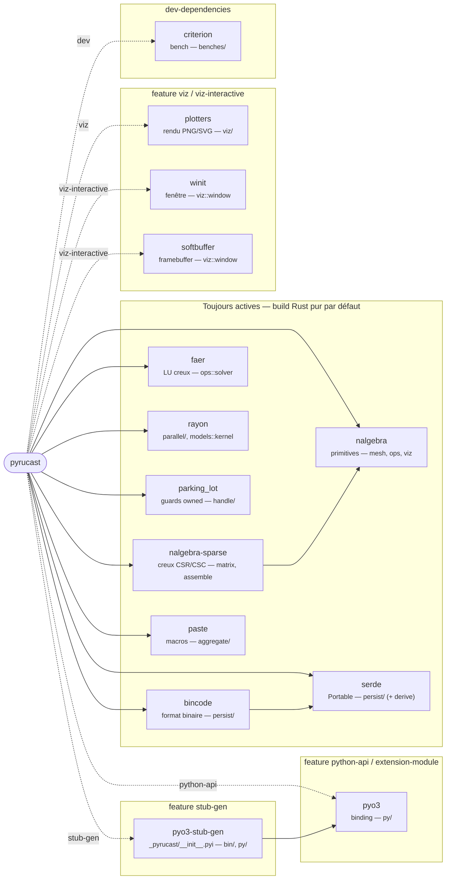

# Arborescence

La carte des sources : où vit chaque morceau. La règle d'or est la
**séparation conteneurs / opérateurs / binding** — les structures de données
(`containers/`) ne connaissent pas les opérateurs (`ops/`), et le binding
Python (`py/`) est un miroir 1:1 qui n'ajoute aucune logique.

Deux découpages secondaires en découlent, et l'arborescence les rend
visibles : les types indivisibles vivent dans `atoms/` (seul un conteneur
peut être le sujet d'un opérateur), et chaque module d'`ops/` porte le nom
du **conteneur qu'il produit**.

```text
src/
├── lib.rs              # racine de la crate + #[pymodule] (enregistrement Python)
│
├── handle.rs           # Handle<T> : Arc<RwLock<T>>, guards possédés, identité
├── persist.rs          # trait Portable (serde + bincode), format portable
├── error.rs            # PyrucastError + Result (l'unique type d'erreur)
├── dump.rs             # trait Dump (3ᵉ niveau d'affichage : contenu intégral)
├── aggregate.rs        # trait Aggregate + macros (len/[i]/union, pyméthodes)
├── parallel.rs         # prelude rayon + politique de grain (MIN_PARALLEL_LEN)
├── interrupt.rs        # trait Cancel + jetons (NoCancel, AtomicBool, Deadline)
│
├── coords.rs           # LE MAGASIN : Coords (jeux de coordonnées, refcount par nœud)
│
├── atoms/              # LES INSÉCABLES (jamais sujet d'un opérateur)
│   ├── mod.rs
│   ├── node.rs         # Node (accesseur RAII) + NodeId
│   ├── cell.rs         # Cell (désigne une maille d'un SubMesh)
│   ├── element.rs      # Element (désigne un élément d'un SubFiniteElementSpace)
│   ├── element_type.rs # enum ElementType (stockage, sérialisation, ALL, as_kind)
│   ├── element_kind/   # UN FICHIER PAR ÉLÉMENT + le trait qui les lie
│   │   ├── mod.rs          # trait ElementKind, Facet, as_kind()
│   │   ├── interpolation.rs# enum Interpolation (façade sur ElementKind::degree)
│   │   ├── quadrature.rs   # enum QuadratureRule (façade + briques partagées)
│   │   └── tri3.rs, tri6.rs, hex8.rs, …  # un par type d'élément
│   ├── point.rs        # Point2 / Point3 / Vector2 / Vector3 (nalgebra)
│   ├── band.rs         # Band (bande de valeurs ge/gt/le/lt — mask, select)
│   └── color.rs        # RgbColor (couleur de face, viz)
│
├── containers/         # LES DIVISIBLES (structures de données, aucune dépendance à ops/)
│   ├── mod.rs
│   ├── mesh.rs         # Mesh, SubMesh
│   ├── finite_element_space/
│   │   └── mod.rs          # FiniteElementSpace, SubFiniteElementSpace
│   ├── field.rs        # traits Field / SubField (contrat commun des champs)
│   ├── node_field.rs   # NodeField / SubNodeField
│   ├── element_field.rs# ElementField / SubElementField
│   ├── model.rs        # Model / SubModel (enum de stockage + dispatch)
│   ├── matrix.rs       # Matrix / SubMatrix (matrice creuse COO)
│   └── evolution.rs    # Evolution / SubEvolution (valeur tabulée, interpolée)
│
├── models/             # LES PHYSIQUES (une struct + impl SubModelKind par fichier)
│   ├── mod.rs              # traits SubModelKind / Domain / Constraint, MatrixKind
│   ├── kernel.rs           # LES DRIVERS parallèles au-dessus des noyaux purs
│   ├── heat_conduction.rs
│   ├── boundary_transfer.rs # échange de surface avec une ambiante (Robin / film)
│   ├── transfer.rs         # le noyau h∫NiNj partagé par les deux échanges
│   ├── truss.rs
│   ├── elasticity.rs
│   ├── plasticity.rs       # von Mises parfaite
│   ├── mazars.rs           # endommagement
│   ├── timoshenko.rs
│   ├── frame.rs           # portique 2D
│   ├── frame3d.rs         # cadre 3D
│   ├── dirichlet.rs       # contrainte (multiplicateurs de Lagrange)
│   ├── mpc.rs             # relation multi-points
│   ├── embedded.rs        # baignage (nœuds immergés dans un hôte)
│   └── contact.rs         # contact nœud-surface (unilatéral)
│
├── ops/                # LES OPÉRATEURS — un module par conteneur produit
│   ├── mod.rs
│   ├── mesh/           # → Mesh : mailleurs, transformations, select
│   │   ├── triangulation/  # briques 2D Delaunay (ear clipping, CDT, Ruppert)
│   │   ├── tetrahedralization/  # briques 3D Delaunay (prédicats exacts, …)
│   │   ├── paving/         # front avançant 2D (pave_surface)
│   │   └── plaster/        # front avançant 3D (pave_volume)
│   ├── node_field/     # → NodeField : positions, divergence, restrict, flux, …
│   ├── element_field/  # → ElementField : gradient, deformation, material_field
│   │   └── behavior.rs     # intégration de la loi de comportement (COMP)
│   ├── model/          # → Model : les déclarations de physique. Les formes
│   │                   #   courantes sont déclarées dans models/<nom>.rs et
│   │                   #   seulement ré-exportées ici ; les contraintes et les
│   │                   #   variantes à symétrie gardent leur fichier
│   ├── matrix.rs       # → Matrix : stiffness, mass, geometric, tangent, lump
│   ├── coords.rs       # écrit dans le magasin : set, displace
│   ├── measure/        # → un nombre : integral, xtx, xty
│   ├── geom/           # → une position : locate_points, project_points (internes)
│   ├── field/          # polymorphe champ → même champ : mask, maths élémentaires
│   ├── solver/         # → NodeField (l'exception nommée) : solve, eliminate, unilateral
│   ├── export/         # effets de bord : export VTK (read_gmsh côté mesh)
│   ├── coloring.rs     # machinerie d'assemblage partagée (pas un opérateur)
│   └── scatter.rs      # idem
│
├── py/                 # BINDING PyO3 (miroir 1:1 de containers/ + ops/)
│   ├── mod.rs
│   ├── coords.rs, node.rs, cell.rs, mesh.rs, …   # un wrapper Py<Foo> par objet
│   ├── signals.rs      # jeton PySignals (Ctrl+C via Python::check_signals)
│   └── ops/            # un wrapper par module d'opérateurs
│
├── viz/                # VISUALISATION (feature `viz` / `viz-interactive`)
│   ├── mod.rs, drawable.rs, mesh_draw.rs, camera.rs, field_color.rs,
│   │                     axes.rs, curve.rs, overlay.rs, revolve.rs
│   ├── subdivide.rs    # rendu interpolé (découpe des faces)
│   └── window.rs       # fenêtre interactive (feature `viz-interactive`)
│
└── bin/
    ├── stub_gen.rs     # génère le stub .pyi (feature `stub-gen`)
    └── scaling.rs      # mesure de montée en charge (parallélisme)
```

Le **paquet Python** est à côté des sources Rust : le projet est un *mixed
layout* maturin, et l'extension compilée est le sous-module **privé**
`_pyrucast`, plat. La couche Python pure ne fait que le ranger — c'est elle qui
donne à l'API sa forme publique (`pyrucast.<module>.<verbe>`).

```text
python/pyrucast/
├── __init__.py        # conteneurs + atomes au top-level (Mesh, Coords, …)
├── mesh.py            # un module par module d'ops/ : ré-exporte _pyrucast
├── node_field.py      #   en rendant leur vrai nom aux homonymes
├── element_field.py   #   (`consolidate_mesh as consolidate`, …)
├── matrix.py, model.py, field.py, measure.py, export.py, solver.py, coords.py
├── thermomechanics.py # couche Python pure de haut niveau
├── py.typed
└── _pyrucast/
    └── __init__.pyi   # stub typé, généré par stub_gen, versionné
```

À la racine du dépôt :

```text
Cargo.toml          # crate (cdylib + rlib), features, dépendances approuvées
pyproject.toml      # côté maturin (python-source = python, module-name)
CONVENTIONS.md      # règles de code (source de la page Conventions)
script/check_all.sh # enchaîne toutes les vérifications (check_*.sh isolément)
tests/              # tests d'intégration Rust (*.rs) + tests Python (python/)
examples/           # scripts Python complets (thermique, treillis, poutres…)
formation/          # scripts de la formation débutant
benches/            # bancs criterion (parallel.rs, geom.rs)
book/               # cette documentation (mdbook)
```

## Graphe des dépendances externes

Les crates tierces (`Cargo.toml`) et, pour chacune, le module où elle est
**confinée** — une des règles du projet est qu'une dépendance ne fuit pas hors
de son étage. Les arêtes pleines sont toujours liées ; les arêtes pointillées
ne le sont que si la **feature** correspondante est activée. Le `cargo build`
par défaut est **Rust pur** : rien de pointillé n'est compilé.



Les implications de features (`Cargo.toml`) : `extension-module` ⊃
`python-api` (active `pyo3`, mais demande à pyo3 de **ne pas** lier
`libpython` — l'interpréteur hôte le fournit) ; `viz-interactive` ⊃ `viz` ;
`stub-gen` ⊃ `python-api`. Le confinement annoté ci-dessus est la raison pour
laquelle le cœur de calcul reste compilable et testable sans aucune de ces
crates optionnelles.

## Les trois couches, et pourquoi

| Couche | Rôle | Ne dépend pas de |
|---|---|---|
| `containers/` | structures de données + invariants | `ops/`, `py/` |
| `ops/` | opérateurs croisant des conteneurs | `py/` |
| `py/` | exposition Python (PyO3), miroir 1:1 | — |
| `python/pyrucast/` | rangement du module plat `_pyrucast` en sous-modules | — |

Cette stratification garde le cœur de calcul **testable sans Python** (`cargo
test`) et **réutilisable** en pure crate Rust. Le `models/` est à part : ce
sont les physiques, branchées sur les conteneurs (`Model`/`SubModel`) via le
trait `SubModelKind` — voir [Ajouter une physique](../ajouter-une-physique.md).

## Où ajouter quoi ?

| Pour ajouter… | Toucher principalement |
|---|---|
| un type d'élément | `atoms/element_kind/<nom>.rs` + 2 lignes dans `atoms/element_kind/mod.rs` + 2 dans `atoms/element_type.rs` ([guide](ajouter-un-element-fini.md)) |
| une physique | `models/<nom>.rs` (physique, tests **et** opérateur via `physics_operator!`) + 2 lignes dans `containers/model.rs` + le raccord `pub use` / `add_function` ([guide](../ajouter-une-physique.md)) |
| un opérateur | `ops/<conteneur produit>/<nom>.rs` + son wrapper `py/ops/<même module>.rs` + son ré-export dans `python/pyrucast/<même module>.py` |
| un objet conteneur | `containers/<nom>.rs` + `py/<nom>.rs` + son ré-export dans `python/pyrucast/__init__.py` + un chapitre de doc |

> **Le troisième site est facile à oublier.** Une fonction libre exposée par
> PyO3 atterrit dans le module **plat** `_pyrucast` ; tant qu'elle n'est pas
> ré-exportée dans `python/pyrucast/<module>.py`, elle n'existe pas dans l'API
> publique. Les homonymes y reprennent au passage leur vrai nom
> (`consolidate_mesh as consolidate`) — voir
> [Conventions & philosophie](../conventions.md#le-miroir-python).
