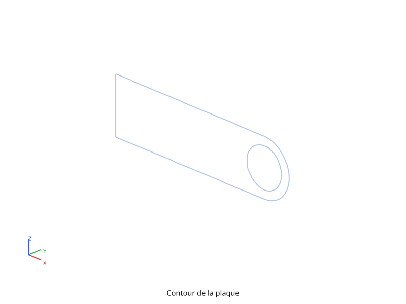
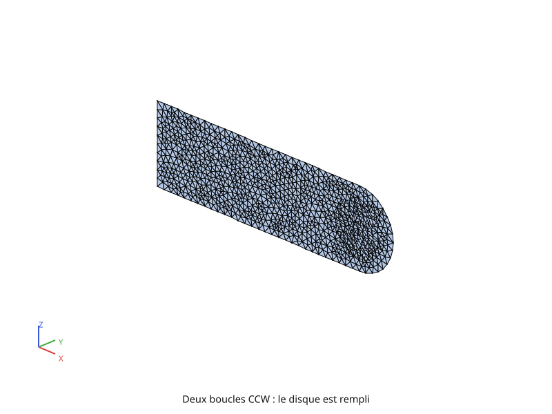
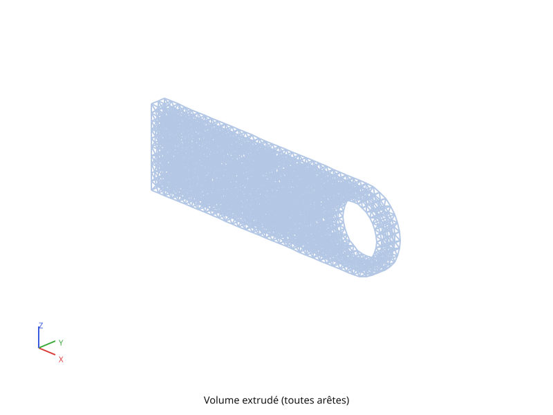
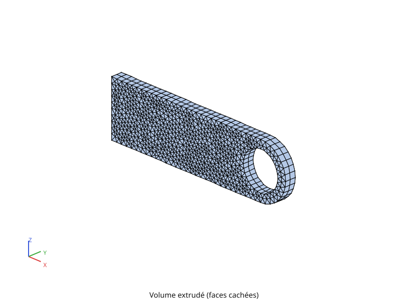
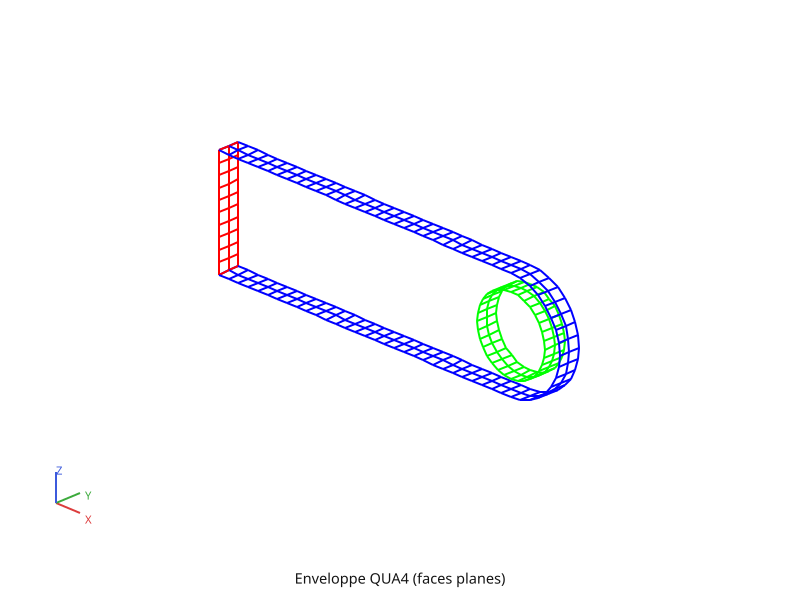
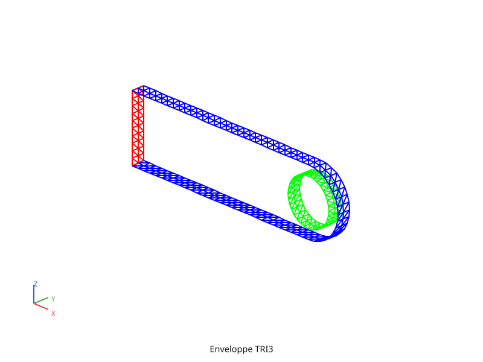
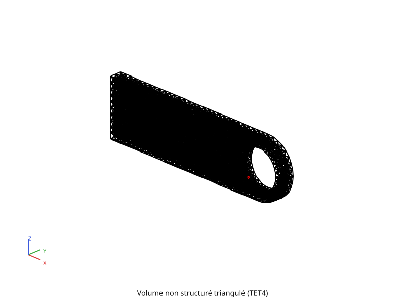
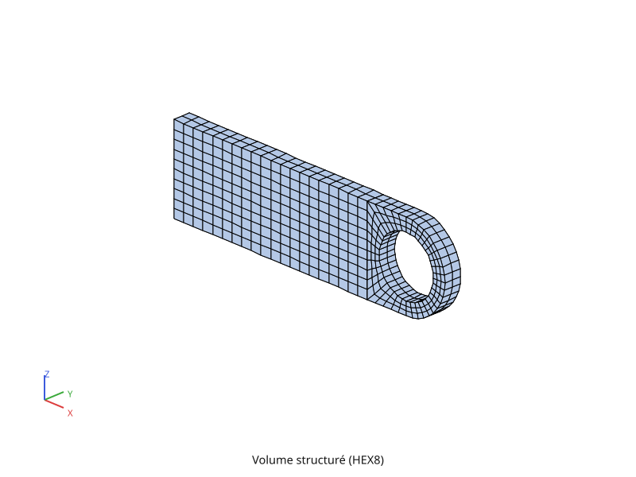

# Maillage

Fil rouge de la formation : une **chape percée** — plaque rectangulaire
terminée par un demi-disque, trouée en son centre. C'est l'équivalent
pyrucast de la pièce « structure avec un trou » de la formation Cast3M originale.

Plaque de 30 cm × 10 cm, demi-disque de rayon 5 cm, trou de rayon 3,5 cm
centré sur le demi-disque, épaisseur 2 cm. La pièce est plane dans **XZ** et
son épaisseur est portée par **Y** : la géométrie est en `Coords(3)` dès le
départ, il n'y a donc rien à relever au moment de passer au volume.

Deux familles de mailleurs coexistent :

| | on donne… | le mailleur… | topologie |
|---|---|---|---|
| **non structuré** | une **taille de maille** cible | place ses propres nœuds à l'intérieur | quelconque |
| **structuré** | un **nombre d'éléments** | balaie une ligne sur une autre | grille |

Le script complet est [`formation/maillage.py`](https://github.com/Pyrucast/pyrucast/blob/master/formation/maillage.py)
; tous les extraits ci-dessous en sont issus directement.

## Points guides

On pose d'abord les quelques points qui définissent la pièce — les points 
`p1`/`p2`/`p4`/`p5` sont les coins du rectangle, `p6` le centre du
demi-disque **et** du trou, `p3` la pointe. Ce sont les seuls nœuds saisis à
la main de tout le script : tous les autres sortent d'un mailleur.

```python
{{#include ../../../formation/maillage.py:geometrie}}
```

`pyrucast.Coords` est le seul objet mutable du script. Tous les mailleurs y
déposent leurs nœuds, ce qui garantit que deux maillages construits côte à
côte partagent bien leurs nœuds communs.

## Contour fermé

Le contour se maille **bord par bord**, chacun avec son mailleur dédié :
`line` pour les côtés droits, `arc` pour le demi-disque, `circle` pour le
trou.

```python
{{#include ../../../formation/maillage.py:contour}}
```



Deux points méritent l'attention.

**Le nombre d'éléments par bord est décidé ici, et seulement ici.**
`triangulate_surface` respecte le contour qu'on lui donne : il ne redécoupe
jamais un segment du bord. La finesse du contour est donc un choix de
l'utilisateur, indépendant de la taille de maille demandée pour l'intérieur.

**`consolidate` est obligatoire.** L'union `|` réunit les cinq bords dans un
même maillage, mais chacun y garde son propre sous-maillage `SEG2`. Or
`triangulate_surface` exige qu'une boucle fermée tienne dans **un seul**
sous-maillage. `pyrucast.consolidate` les fusionne sans toucher à la
connectivité.

Le contour renvoyé compte donc deux sous-maillages : le contour extérieur,
puis le trou.

## Maillage non structuré : triangulation

`triangulate_surface` remplit l'intérieur par triangulation de Delaunay
contrainte, raffinée à la taille cible (raffinement de Ruppert).

```python
{{#include ../../../formation/maillage.py:non_structure}}
```

Le point à retenir est **l'orientation des boucles**. Le mailleur la lit pour
savoir ce qui est matière et ce qui ne l'est pas :

- une boucle **antihoraire** (CCW) est le bord extérieur d'un domaine ;
- une boucle **horaire** (CW) est un trou, contenu dans une boucle extérieure ;
- plusieurs boucles CCW disjointes maillent plusieurs domaines indépendants.

Ici `circle` produit une boucle qui tourne dans le même sens que le contour
extérieur. Telle quelle, elle n'est donc pas lue comme un trou mais comme un
second domaine, et le disque est rempli :



`invert` retourne la boucle du trou, et le mailleur y voit alors un vrai
trou :


`size` n'est qu'une taille **cible** : le raffinement insère ses propres
nœuds à l'intérieur jusqu'à l'approcher, sans jamais toucher au bord.

## Du surfacique au volumique

La suite enchaîne quatre opérateurs pour passer de la surface au volume
tétraédrique.

```python
{{#include ../../../formation/maillage.py:volume}}
```

### `extrude` — balayage sur l'épaisseur

L'extrusion balaie la surface le long d'un vecteur, en un nombre de couches
donné. Le type d'élément suit : `SEG2` → `QUA4`, `TRI3` → `PENTA6`,
`QUA4` → `HEX8`.



En `wireframe=True` toutes les arêtes sont tracées, y compris celles de
l'intérieur : on voit le maillage traverser la pièce. Le même volume, faces
cachées, ne montre que la peau :



### `skin` — la peau, découpée en faces planes

`skin` extrait les facettes du bord du volume et les **regroupe par face
plane** : deux facettes voisines restent dans la même face tant que leurs
normales diffèrent de moins de l'angle donné. On obtient un sous-maillage par
face — dessus, dessous, chant du trou, chant extérieur — donc colorable et
sélectionnable indépendamment, ce qui sert directement à poser les conditions
aux limites.



*(La figure ne montre que les faces intermédiaires, `skin[1:-1]`, pour voir à
travers la pièce.)*

### `convert` + `invert` — préparer l'enveloppe

`triangulate_volume` n'accepte qu'une enveloppe **TRI3** fermée dont les
normales **sortent de la matière**. `convert` coupe chaque `QUA4` en deux
`TRI3` sans ajouter le moindre nœud ; `invert` retourne l'ensemble dans le
bon sens.



### `triangulate_volume` — remplissage TET4

C'est le compagnon 3D de `triangulate_surface` : il remplit l'intérieur de
l'enveloppe de tétraèdres.



`allow_surface_nodes=True` autorise le mailleur à redécouper l'enveloppe là
où il ne sait pas la respecter telle quelle. La **forme** est conservée —
chaque nœud ajouté est posé sur l'arête ou la facette qu'il divise — mais la
peau du résultat ne coïncide plus maille pour maille avec celle qu'on a
fournie. Sans cette autorisation, une telle enveloppe serait refusée plutôt
que mal maillée.

> **Le résultat porte alors un sous-maillage de plus.** Quand des nœuds ont
> dû être ajoutés, `triangulate_volume` prévient sur `stderr` **et** les
> nomme : le maillage renvoyé contient un second sous-maillage, de `POI1`, à
> côté des `TET4`. `element_types()` vaut donc `['TET4', 'POI1']` et non
> `['TET4']`. Tout ce qui parcourt les sous-maillages ou compte des mailles
> doit prendre le `TET4` seul. Sur la figure ci-dessus, les tétraèdres sont
> en noir et ce sont ces nœuds ajoutés que l'on voit en rouge.

## Maillage structuré : grille et couronne

En structuré on ne donne plus une taille de maille mais un **nombre
d'éléments** par direction. La pièce est traitée en deux morceaux : une
grille rectangulaire à gauche, une couronne autour du trou à droite.

```python
{{#include ../../../formation/maillage.py:structure}}
```


Trois idées à retenir.

**Balayer plutôt que remplir.** `extrude(ligne, vecteur, n)` balaie une ligne
par translation ; `sweep(a, b, n)` balaie une ligne **sur une autre**, en `n`
couches. Un `SEG2` balayé donne un `QUA4`, d'où une grille régulière dans les
deux cas.

**Un bord se récupère, il ne se refabrique pas.** Pour raccorder la couronne à
la grille, il faut le bord droit de la grille. Le reconstruire avec `line`
donnerait une ligne jumelle ne partageant aucun nœud avec la grille, donc un
maillage non conforme et une pièce en deux morceaux. On l'**extrait** :
`border` donne le contour de la grille, une sélection sur la coordonnée X
(`field.coordinates` + `field.select`) garde les nœuds de la dernière
colonne, et `elements_on(..., strict=True)` remonte aux segments dont **tous**
les nœuds y sont. Même méthode pour les deux extrémités de ce bord, repérées
par leur coordonnée Z. Aucun indice n'est écrit à la main.

**Les deux boucles doivent se correspondre.** `sweep` relie les nœuds de la
première boucle à ceux de la seconde, une paire à la fois : elles doivent donc
avoir le **même nombre de segments**. D'où le découpage du contour extérieur
en 10 + 10 + 5 + 10 + 5 = 40 segments, et celui du trou en quatre quarts de
10 segments, soit 40 également — les quatre points de départ `p14`…`p17` sont
posés explicitement pour que les deux découpages s'alignent.

`sweep` entre deux boucles fermées est le moyen d'obtenir un maillage structuré
propre autour d'un trou. Grille et couronne partageant les nœuds du bord
droit, l'union `|` suffit à en faire un maillage conforme.

La même extrusion que pour le non structuré donne enfin le volume — mais un
`QUA4` balayé donne un `HEX8`, le meilleur élément pour le calcul :



C'est ce volume que reprennent les chapitres suivants : ils importent
`structured_mesh` et l'appellent avec `plot=False`, qui rend le maillage sans
retracer les figures de cette page. Importer la fonction plutôt que recopier
sa géométrie n'est pas un raffinement de style — deux maillages construits à
l'identique dans deux scripts porteraient des nœuds **distincts**, et toute
condition posée sur l'un serait sans effet sur l'autre.

## Visualiser et exporter

Une seule méthode, `plot(...)`, sur `Mesh`/`SubMesh` — l'équivalent de
`TRAC` :

```python
plaque.plot(save="plaque.svg")  # export sans fenêtre
plaque.plot(save=None)  # fenêtre interactive (souris)
```

`save=None` ouvre une fenêtre interactive (nécessite la feature Cargo
`viz-interactive`) ; `save="....png"` ou `"....svg"` exporte sans fenêtre
(feature `viz`) — voir [Visualisation](../visualization.md) pour le détail
(caméra, colormaps, coloration par champ).

Le script réunit les deux dans un petit helper, pour que chaque tracé soit
interactif à l'exécution et devienne une figure de cette page en mode batch :

```python
OUT = os.environ.get("PYRUCAST_FORMATION_IMG_DIR")


def show(mesh, title, file, wireframe=False):
    mesh.plot(
        view=VUE,
        title=title,
        wireframe=wireframe,
        save=os.path.join(OUT, file) if OUT else None,
    )
```

L'attribut `face_color` d'un sous-maillage fixe sa couleur de tracé, ce qui
sert à distinguer les faces d'une peau ou à faire ressortir un groupe de
nœuds.

Les figures SVG de cette formation (`img/*.svg`) sont pré-générées à partir
des scripts `formation/*.py` et commitées avec le livre — `mdbook build` ne
connaît pas Python, elles ne sont donc **pas** régénérées automatiquement.
Après modification d'un script, régénérer avant de committer :

```bash
script/generate-formation-figures.sh
```

## Script complet

```python
{{#include ../../../formation/maillage.py}}
```

Suite : [Calcul thermique](thermique.md), sur une version 2D simplifiée de
cette plaque — la géométrie y passe au second plan, l'attention va aux
conditions aux limites.
