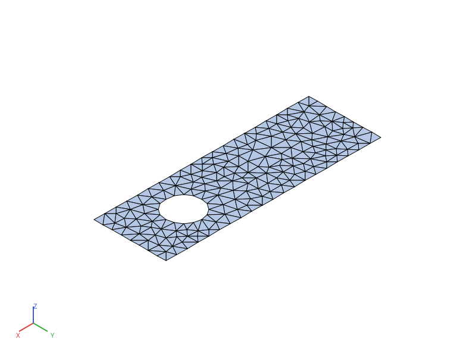
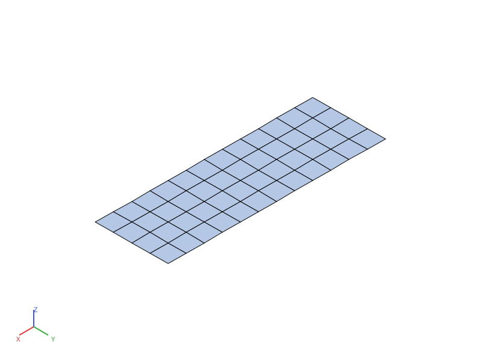

# Maillage

Fil rouge de toute la formation : une **plaque rectangulaire percée d'un
trou circulaire** — l'équivalent pyrucast, en 2D, de la pièce « structure
avec un trou » du support Cast3M original (un tube troué, en 3D). pyrucast
sait mailler des volumes 3D (`pyrucast.mesher.volume`, `sweep_solid`,
`extrude`), mais la formation reste en 2D pour se concentrer sur les
concepts — [Compléments](complements.md) pointe vers la 3D pour la suite.

Plaque de 30 cm × 10 cm, trou de rayon 2,5 cm centré aux 3/4 de la longueur.

Comme en Cast3M, deux familles de mailleurs coexistent : **non structuré**
(triangulation, taille de maille cible) et **structuré** (balayage entre
deux bords, nombre d'éléments imposé).

## Maillage non structuré : triangulation avec trou

Méthode, identique dans l'esprit à Cast3M (1. placer des points guides, 2.
mailler le contour fermé, 3. remplir par triangulation) :

1. construire le contour extérieur (une boucle fermée de `SEG2`) ;
2. construire le contour du trou (`pyrucast.mesher.circle_seg2`) ;
3. unir les deux boucles (`|`) — la plus grande, par aire signée, est
   traitée comme le contour extérieur, les autres comme des trous ;
4. remplir par triangulation de Delaunay contrainte, raffinée à une taille
   de maille cible (`pyrucast.mesher.fill_surface`).

```python
{{#include ../../../formation/maillage.py:geometrie}}
```

```python
{{#include ../../../formation/maillage.py:non_structure}}
```



`fill_surface` est l'équivalent de la triangulation Cast3M avec trou (une
combinaison de `SURF ... 'PLAN'` sur un contour incluant un trou inversé) —
sans étape d'inversion manuelle : l'orientation des boucles n'a pas
d'importance, seule leur aire relative compte.

> **Différence avec Cast3M.** Le mailleur frontal à taille imposée
> (`pyrucast.mesher.surface`, l'équivalent de Cast3M `SURF` avec un
> paramètre de taille) ne prend en charge, à ce jour, qu'un contour à
> **une seule boucle** — pas de trou. C'est `fill_surface`
> (triangulation de Delaunay contrainte, avec raffinement) qui sait
> mailler un domaine à trous ; c'est elle qu'on utilise ici.

## Maillage structuré : balayage entre deux bords

Méthode Cast3M : placer des points guides, mailler des lignes opposées,
mailler la surface réglée entre elles. pyrucast condense les deux dernières
étapes en un seul opérateur, `pyrucast.mesher.sweep` :

```python
{{#include ../../../formation/maillage.py:structure}}
```



`line(a, b, n)` maille un segment en `n` éléments (Cast3M `DROI n a b`)
; `sweep(bord_a, bord_b, n)` relie deux lignes discrétisées par des
`QUA4`, `n` couches entre elles (Cast3M : surface réglée `REGL` + maillage).

> **Différence avec Cast3M.** pyrucast n'a pas encore l'équivalent de la
> surface réglée `REGL` utilisée en Cast3M pour mailler *proprement*, en
> structuré, le pourtour d'un trou (cercle intérieur réglé vers le contour
> extérieur). La version structurée ci-dessus reste donc une grille simple,
> sans trou — le trou n'est traité qu'en non structuré pour l'instant.

## Visualiser et exporter

Une seule méthode, `plot(...)`, sur `Mesh`/`SubMesh` — l'équivalent de
`TRAC` :

```python
plaque.plot(save="plaque.svg")          # géométrie seule
plaque.plot(save=None)                  # fenêtre interactive (souris)
```

`save=None` ouvre une fenêtre interactive (nécessite la feature Cargo
`viz-interactive`) ; `save="....png"` ou `"....svg"` exporte sans fenêtre
(feature `viz`) — voir [Visualisation](../visualization.md) pour le détail
(caméra, colormaps, coloration par champ).

Les figures SVG de cette formation (`img/*.svg`) sont pré-générées à partir
des scripts `formation/*.py` et commitées avec le livre — `mdbook build` ne
connaît pas Python, elles ne sont donc **pas** régénérées automatiquement.
Après modification d'un script, régénérer avant de committer :

```bash
script/generate-formation-figures.sh
```

## Script complet

```python
{{#include ../../../formation/maillage.py}}
```

Suite : [Calcul thermique](thermique.md), sur cette même plaque.
