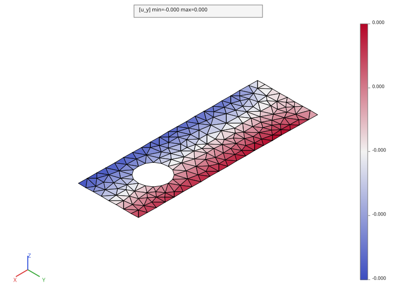
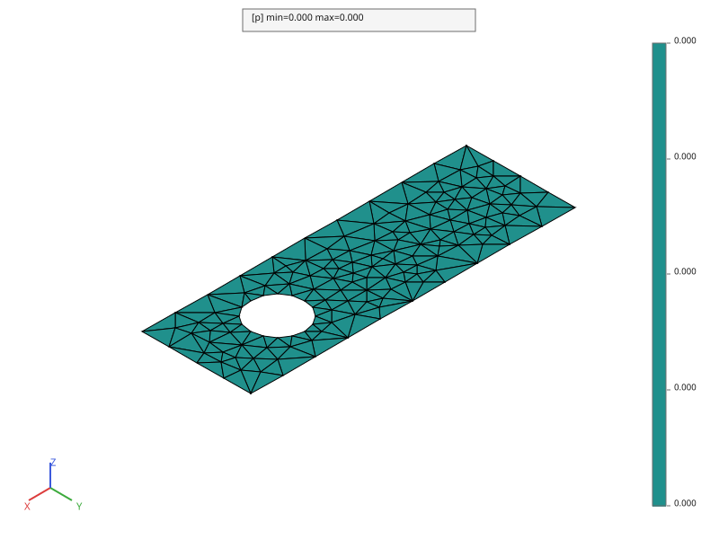
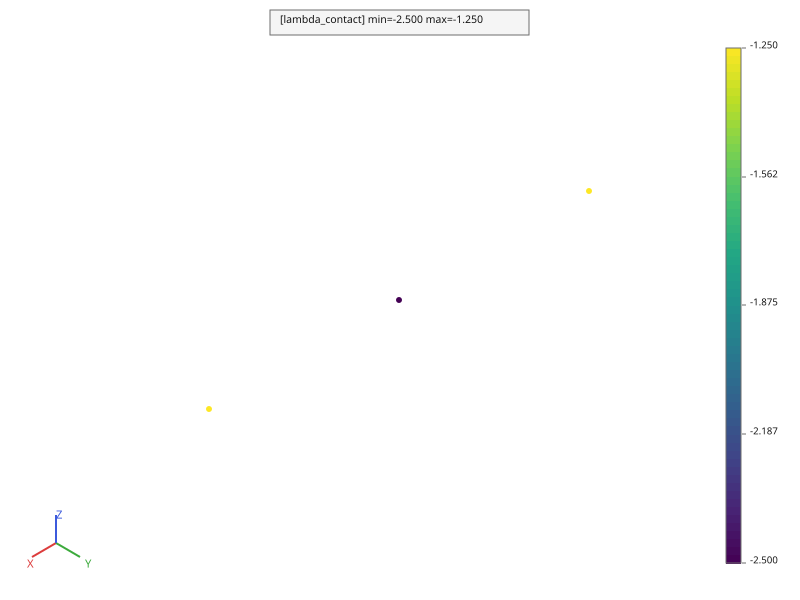

# Calcul mécanique

Toujours la même plaque trouée : bord gauche encastré, effort réparti sur la
moitié basse du trou (la « masse suspendue » du TD Cast3M). Trois volets,
dans le même ordre que le support original — élasticité linéaire (sections
6-7-8), plasticité non linéaire pas à pas (section 9), contact unilatéral
(section 10).

## 1. Élasticité linéaire

```python
{{#include ../../../formation/mecanique.py:construction}}
```

Le modèle : élasticité (contraintes planes), encastrement `u_x = u_y = 0`
sur le bord gauche, effort réparti sur l'arc bas du trou (Cast3M
`FSUR 'MASS'`/`PRES 'MASS'`, ici `pyrucast.node_field.flux` en composante
`f_y`) :

```python
{{#include ../../../formation/mecanique.py:modele_elastique}}
```

```python
{{#include ../../../formation/mecanique.py:cas1_elastique}}
```

## 2. + Dilatation thermique

On réutilise le champ de température résolu comme en
[Calcul thermique](thermique.md) (température imposée sur le bord du trou)
pour calculer une déformation thermique et l'ajouter au chargement —
l'équivalent Cast3M `EPTH` :

```python
{{#include ../../../formation/mecanique.py:cas2_thermique}}
```

Trois briques, à la main, sans opérateur « tout-en-un » — comme en Cast3M
(`EPTH` + `ELAS` + `BSIG`) :

1. `pyrucast.element_field.thermal_strain` : \\( \varepsilon\_{\text{th}} =
   \alpha \cdot (T - T\_{\text{ref}}) \\), la même formule que Cast3M
   `EPTH`, à partir d'un champ de température **aux points de Gauss**
   (`pyrucast.element_field.interp_to_gauss`) ;
2. `pyrucast.element_field.integrate_behavior` : la pseudo-contrainte thermique
   \\( \sigma\_{\text{th}} = D : \varepsilon\_{\text{th}} \\) ;
3. `pyrucast.node_field.internal_forces` : la charge nodale équivalente
   \\( F\_{\text{th}} = \int B^T \sigma\_{\text{th}} \, dV \\) (Cast3M
   `BSIG`).

Le second membre se combine par **addition de champs** (`+`), pas par union
(`|`) : `internal_forces` couvre tous les nœuds mécaniques, l'effort
extérieur n'en couvre qu'une partie — `pyrucast.node_field.restrict_like`
étend l'un sur le support de l'autre avant de les additionner. C'est la même
distinction que la note de la page [Calcul thermique](thermique.md) : `|`
pour des supports disjoints, `+`/`-` pour une véritable superposition sur un
support commun.



> **Pour aller plus loin — matériau hétérogène (Cast3M section 8).** Cast3M
> fait varier `α(x)` par une formule évaluée sur un champ aux points de
> Gauss (loi normale centrée sur la plaque). pyrucast le permettrait de la
> même façon : un `ElementField` accepte des valeurs non uniformes par
> `(cellule, point de Gauss)`, et `pyrucast.field.exp`/l'arithmétique de
> champs (`+ - * **`) suffiraient à coder la formule — mais ce script ne le
> met pas en œuvre, faute d'un exemple testé à ce jour dans cette
> formation.

## 3. Plasticité parfaite — pas à pas

Le chargement dépasse maintenant la limite élastique. Comme Cast3M pilote
ce cas par la procédure `PASAPAS`, pyrucast fournit
`pyrucast.thermomechanics.step_by_step` : la boucle sur les pas de charge,
un Newton **modifié** (rigidité élastique, réassemblée une fois par pas) et
son **accélération d'Anderson**. Il suffit de remplacer
`Model.elasticity` par `Model.plasticity_perfect` :

```python
{{#include ../../../formation/plasticite.py:modele_plastique}}
```

L'historique de charge est un `Evolution` **à valeur champ**, interpolée
linéairement en pseudo-temps — Cast3M `EVOL 'MANU'` :

```python
{{#include ../../../formation/plasticite.py:chargement_evolution}}
```

```python
{{#include ../../../formation/plasticite.py:pas_a_pas}}
```



> **Piège pyrucast.** Sans `free_mesh`, la norme du résidu de Newton porte
> sur **tous** les nœuds, y compris les nœuds encastrés — dont la réaction
> d'appui, potentiellement énorme, empêche toute convergence. `free_mesh`
> restreint la norme aux degrés de liberté réellement libres (ici : tous
> les nœuds d'abscisse `x > 0`). C'est l'équivalent, en plus explicite, du
> traitement automatique des blocages par Cast3M dans `RESO`/`PASAPAS`.

> **Non disponible dans pyrucast.** `Model.plasticity_perfect` ne consomme pas
> encore la composante matériau optionnelle `alpha` — la dépendance de
> `sigma_y` à la température (Cast3M section 9.2 : `EVOL 'MANU' 'T' ... 'SIGY' ...`)
> n'a donc pas d'équivalent testé ici ; seule la plasticité **isotherme**
> est couverte.

## 4. Contact unilatéral

Cast3M pilote aussi le contact par `PASAPAS` (table `tab3`, section 10).
pyrucast ne compose pas encore thermique + plasticité + contact dans un
même appel `step_by_step` ; le contact se résout directement par le solveur
actif-set `pyrucast.solver.solve_unilateral`, sur un patch-test classique
(deux blocs superposés, jeu initial, pression sur le bloc du haut) :

```python
{{#include ../../../formation/contact.py:geometrie_contact}}
```

```python
{{#include ../../../formation/contact.py:modele_contact}}
```

```python
{{#include ../../../formation/contact.py:chargement_contact}}
```

```python
{{#include ../../../formation/contact.py:resolution_contact}}
```



`model.contact_gaps()` fournit le second membre associé au contact — jeu
initial à combler avant que les multiplicateurs `lambda_contact` ne portent
une réaction non nulle. Voir
[Contact (nœud-surface)](../contraintes/contact.md) pour le détail
mathématique (formulation active-set, jeux, multiplicateurs).

## Scripts complets

```python
{{#include ../../../formation/mecanique.py}}
```

```python
{{#include ../../../formation/plasticite.py}}
```

```python
{{#include ../../../formation/contact.py}}
```

Suite : [Compléments](complements.md) — éléments structuraux et export des
résultats.
