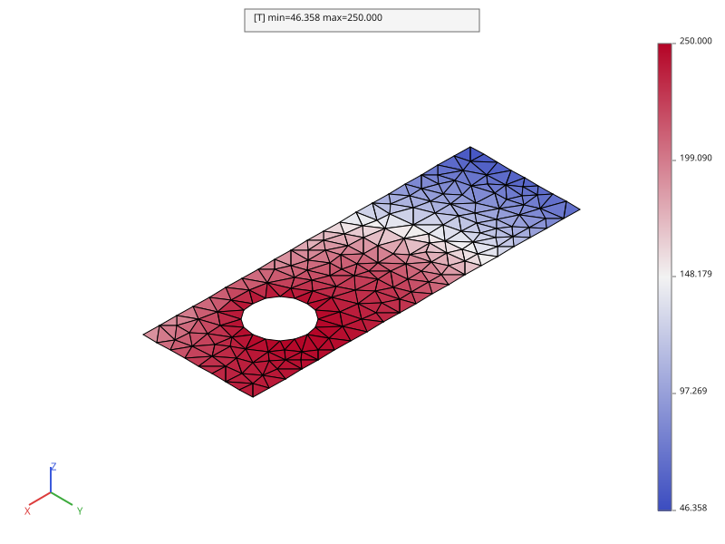

# Calcul thermique

Reprend la chape percée de la page [Maillage](maillage.md) pour un calcul de
**conduction thermique stationnaire**, avec les mêmes quatre types de
sollicitation que le TD Cast3M :

| Chargement | Cast3M | pyrucast |
|---|---|---|
| température imposée (alésage) | `BLOQ 'T'` + `DEPI` | `Model.dirichlet("T", "q", ...)` |
| flux imposé (face gauche) | `FLUX` | `pc.assemble.flux(fes, densité, "q")` |
| convection (nez arrondi) | `MODE ... 'CONVECTION'` + `CONV` | `Model.convection(fes)` + `pc.assemble.flux(fes, h·T_ext, "q")` |
| source volumique (cartouche chauffante) | `SOUR` | `pc.assemble.flux(fes, densité, "q")` sur des éléments sélectionnés |

Le point notable : en pyrucast, **`flux` est l'unique opérateur de charge
répartie**, quelle que soit la dimension du sous-espace éléments finis sur
lequel on l'applique — une face `QUA4` intègre une densité surfacique, un
`HEX8` une densité volumique. Il joue à la fois le rôle de `FLUX`, `PRES` et
`SOUR` en Cast3M.

## On ne remaille pas : on importe

Le script ne redonne **aucune cote**. Il importe `structured_mesh` de
[`formation/maillage.py`](https://github.com/Pyrucast/pyrucast/blob/master/formation/maillage.py)
et calcule sur le volume **HEX8 structuré** du chapitre précédent — 640
hexaèdres.

```python
from maillage import HEIGHT, HOLE_RADIUS, LENGTH, THICKNESS, structured_mesh
```

C'est la bonne façon d'enchaîner deux calculs sur une même pièce : un
maillage reconstruit à l'identique dans deux scripts donnerait deux jeux de
nœuds **distincts**, et toute condition posée sur l'un serait sans effet sur
l'autre.

## Les régions chargées, repérées par leur forme

Aucun numéro de nœud n'apparaît dans le script. Les quatre régions sont
découpées **géométriquement**, avec la famille
[`pyrucast.mesher.points_*`](../operateurs/maillage.md) — l'équivalent du
`POIN ... PLAN` / `CYLI` de Cast3M — suivie de
`pyrucast.mesher.elements_on(..., strict=True)`, l'équivalent de
`ELEM 'APPUYE' 'STRICTEMENT'`.

```python
{{#include ../../../formation/thermique.py:construction}}
```

Trois idiomes valent d'être retenus.

**`on` et `in` ne sélectionnent pas la même chose.** `points_on_cylinder`
retient les nœuds de la **surface latérale**, disques d'extrémité exclus :
c'est exactement la paroi d'un alésage. `points_in_cylinder` retient les
nœuds du **volume plein**, disques compris : c'est le cœur d'une cartouche
chauffante. Même axe, même famille d'opérateurs, deux régions de nature
différente.

**Un `points_*` renvoie déjà un maillage POI1.** Le résultat est donc
directement utilisable comme support d'un `Model.dirichlet`, sans passer par
`pyrucast.mesher.to_poi1`. En revanche un chargement **réparti** s'intègre
sur des éléments, pas sur des nœuds : d'où le `elements_on` qui remonte des
nœuds sélectionnés aux mailles dont ils portent **tous** les sommets.

**`skin` n'est utile que pour les chargements répartis.** Un blocage ne
demande que des nœuds : l'alésage se lit directement sur le volume, et
`points_on_cylinder` y trouve exactement les mêmes 120 nœuds que sur la peau
(les nœuds de la paroi du trou sont des nœuds de bord, par définition). La
convection et le flux, eux, s'intègrent sur des faces : il leur faut de
vraies mailles `QUA4`, que seul `pyrucast.mesher.skin` sait extraire d'un
maillage d'hexaèdres. Le `consolidate` qui suit chaque sélection écarte les
sous-maillages **vides** — le volume en compte deux (la grille et la
couronne), et la grille ne touche pas le trou.

**`strict=True` approche la région par un escalier.** La cartouche est un
cylindre de rayon 35 mm, mais le maillage est structuré : ce qui est retenu
est le paquet de 40 hexaèdres entièrement contenus dedans. C'est le prix à
payer pour que la région chargée soit un sous-maillage conforme — et c'est
le même compromis qu'en Cast3M.

> **Piège pyrucast, sans équivalent Cast3M.** En Cast3M, deux régions
> chargées adjacentes voient leurs contributions nodales **sommées
> automatiquement** lors de l'assemblage. pyrucast combine les seconds
> membres par **union de champs** (`|`), qui exige des supports
> **disjoints** — deux valeurs différentes pour le même `(nœud, composante)`
> lèvent une erreur explicite plutôt que de se sommer silencieusement. C'est
> un choix de conception délibéré (mieux vaut une erreur qu'une somme
> implicite qui masquerait un bug), mais il impose de **dessiner des régions
> de charge deux à deux disjointes**. C'est le cas ici par construction : la
> face gauche, le nez arrondi, l'alésage et la cartouche ne partagent aucun
> nœud.

## Modèle : conduction + convection + température imposée

```python
{{#include ../../../formation/thermique.py:modele}}
```

Les trois sous-modèles se réunissent par `|` parce qu'ils partagent les mêmes
degrés de liberté, « T » en primal et « q » en dual : la convection ajoute
son terme `h·N_i·N_j` **dans** la matrice de conduction, elle ne forme pas un
système séparé. Un seul `material_field` couvre le tout — « k » est réclamé
par la conduction, « h » par la convection.

## Chargements

```python
{{#include ../../../formation/thermique.py:chargements}}
```

## Résolution

```python
{{#include ../../../formation/thermique.py:resolution}}
```

Comme Cast3M `RESO`, `pyrucast.solver.solve` factorise la matrice creuse
(LU parallèle) et met la factorisation en cache.



La lecture du résultat suit les quatre chargements : le maximum (430 °C) est
au cœur de la cartouche, l'alésage est tenu à 250 °C par le blocage, le nez
arrondi est le point froid (224 °C) sous l'effet de la convection, et la face
gauche décroît sous le flux sortant.

> **Non disponible dans pyrucast.**
>
> - **Rayonnement.** Pas de condition de bord de type
>   `ϕ·n = εσ(T⁴∞ − T⁴)` (Cast3M `MODE 'RAYONNEMENT'`) — seules conduction et
>   convection (film/Robin) existent.
> - **Régime transitoire.** La matrice de capacité `C = ∫ρcₚNᵢNⱼ` est
>   assemblable (`pyrucast.assemble.mass`), mais **rien ne la relie encore à
>   une boucle en temps** : chaque pas résout `[K]{T} = {P}` **stationnaire**
>   (pas de `[C]{Ṫ} + [K]{T} = {P}` intégré en temps, pas d'équivalent
>   Cast3M `PASAPAS` pour la thermique). Un `Evolution` peut faire varier
>   un chargement stationnaire d'un pas à l'autre (voir
>   [Calcul mécanique](mecanique.md) pour ce mécanisme appliqué à la
>   mécanique), mais c'est une suite de problèmes stationnaires
>   indépendants, pas une intégration temporelle au sens de Cast3M.

## Script complet

```python
{{#include ../../../formation/thermique.py}}
```

Suite : [Calcul mécanique](mecanique.md), qui réutilise ce champ de
température.
