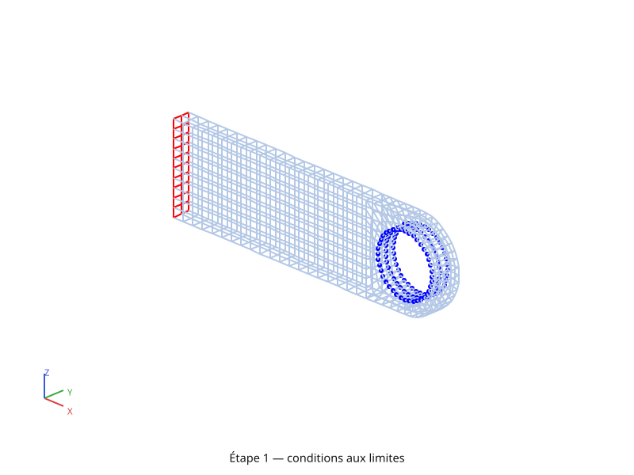
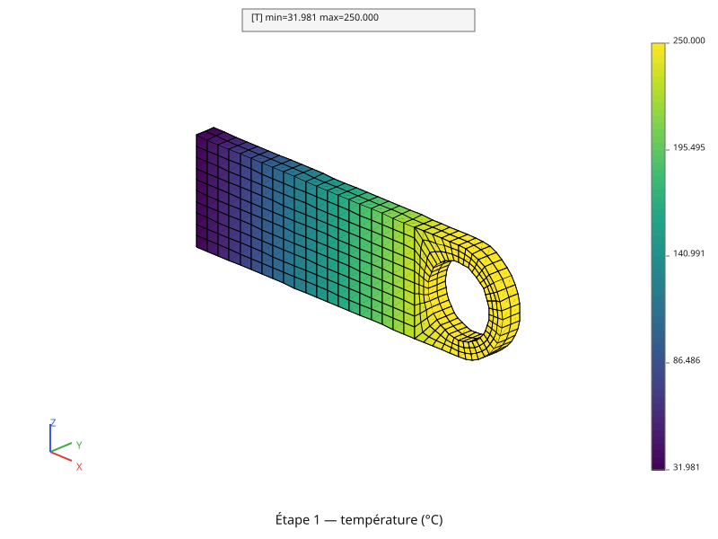
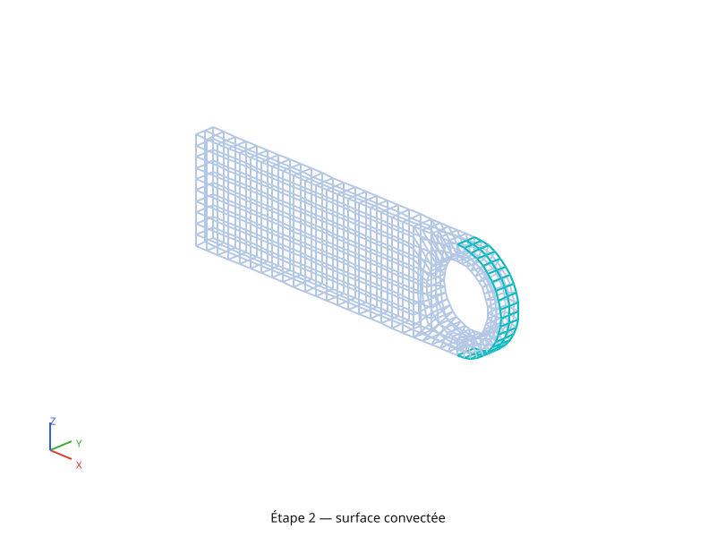
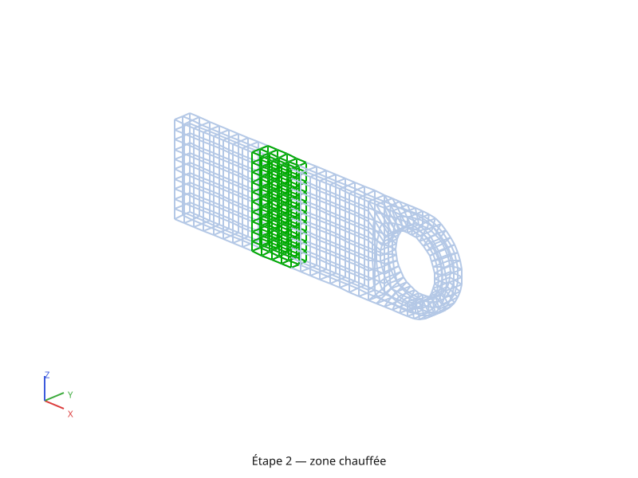
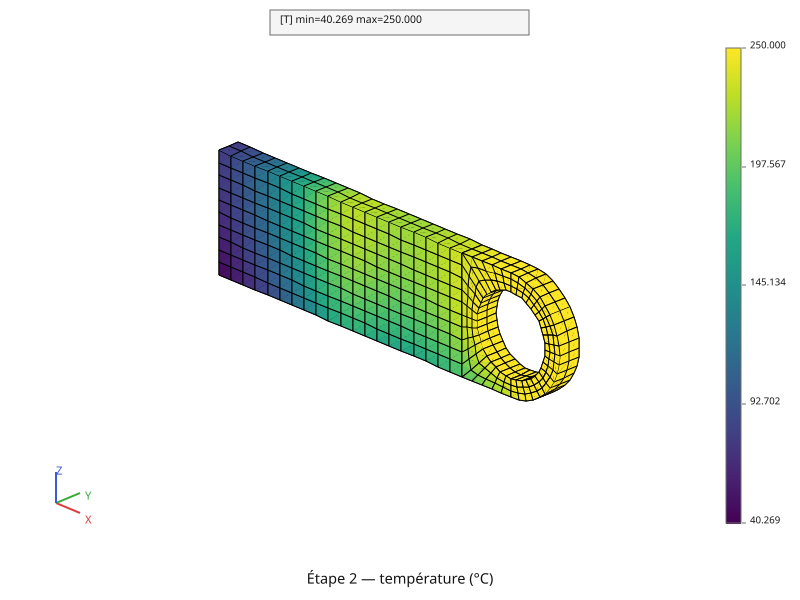

# Calcul thermique

Reprend la chape percée de la page [Maillage](maillage.md) pour un calcul de
**conduction thermique stationnaire**, mené en deux temps : d'abord la
conduction seule (température imposée, flux imposé), puis le même problème
enrichi d'un film convectif et d'une source volumique. Chaque étape est
**tracée avant d'être résolue** — les régions chargées d'abord, le champ de
température ensuite.

## L'équation résolue

Le bilan d'énergie sur un volume `V` s'écrit, avec `φ` la densité de flux de
chaleur et `q` une source volumique :

\\[ \rho c\_p \frac{\partial T}{\partial t} + \operatorname{div}(\phi) = q,
\qquad \phi = -\lambda \operatorname{grad}(T) \\]

En **régime stationnaire** le premier terme disparaît : il reste
\\( \operatorname{div}(-\lambda \operatorname{grad} T) = q \\), complété par
les conditions aux limites — température imposée sur une partie du bord, flux
sur l'autre :

\\[ T = T\_{\text{imp}} \ \text{ sur } \partial V\_T, \qquad
\phi \cdot n = \phi\_{\text{imp}} + h\\,(T - T\_f) \ \text{ sur }
\partial V\_\phi \\]

Le terme en \\( h \\) est la **convection** (loi de Newton) : un échange avec
un fluide à \\( T\_f \\), proportionnel à l'écart de température. Il dépend de
l'inconnue, donc il ne se range pas entièrement au second membre — on y
revient plus bas.

Discrétisée sur les éléments finis, avec
\\( T(x) = [N(x)]\\{T\\} \\) et
\\( \operatorname{grad}(T) = [B(x)]\\{T\\} \\), l'équation devient un système
linéaire :

\\[ [K]\\{T\\} = \\{P\\} \\]

\\[ [K] = \int_V [B]^T \lambda [B] \\, dV
      + \int_{\partial V\_\phi} h\\,[N]^T [N] \\, dS \\]

\\[ \\{P\\} = \int_V [N]^T q \\, dV
      + \int_{\partial V\_\phi} [N]^T (\phi\_{\text{imp}} + h\\,T\_f) \\, dS \\]

Chaque terme correspond à un objet du script :

| Terme | pyrucast |
|---|---|
| \\( \int_V [B]^T \lambda [B] \\, dV \\) | `Model.heat_conduction(fes)`, assemblé par `pc.assemble.stiffness` |
| \\( \int_{\partial V\_\phi} h [N]^T [N] \\, dS \\) | `Model.convection(fes)`, **dans la même matrice** |
| \\( T = T\_{\text{imp}} \\) | `Model.dirichlet("T", "q", ...)` (multiplicateurs de Lagrange) |
| \\( \int_{\partial V\_\phi} [N]^T \phi\_{\text{imp}} \\, dS \\) | `pc.assemble.flux(fes, φ, "q")` sur des `QUA4` |
| \\( \int_{\partial V\_\phi} [N]^T h\\,T\_f \\, dS \\) | `pc.assemble.flux(fes, h·T_ext, "q")` sur des `QUA4` |
| \\( \int_V [N]^T q \\, dV \\) | `pc.assemble.flux(fes, q, "q")` sur des `HEX8` |

Les trois dernières lignes disent le point notable : en pyrucast, **`flux` est
l'unique opérateur de charge répartie**, quelle que soit la dimension du
sous-espace éléments finis sur lequel on l'applique — une face `QUA4` intègre
une densité surfacique, un `HEX8` une densité volumique. Flux surfacique,
pression et source volumique passent donc tous par le même opérateur.

## On ne remaille pas : on importe

Le script ne redonne **aucune cote**. Il importe `structured_mesh` de
[`formation/maillage.py`](https://github.com/Pyrucast/pyrucast/blob/master/formation/maillage.py)
et calcule sur le volume **HEX8 structuré** du chapitre précédent — 640
hexaèdres.

```python
from maillage import HEIGHT, HOLE_RADIUS, LENGTH, OUT, THICKNESS, show, structured_mesh
```

C'est la bonne façon d'enchaîner deux calculs sur une même pièce : un
maillage reconstruit à l'identique dans deux scripts donnerait deux jeux de
nœuds **distincts**, et toute condition posée sur l'un serait sans effet sur
l'autre.

## Étape 1 — conduction seule

Le premier problème n'a que deux conditions aux limites : l'alésage tenu à
250 °C, et un flux sortant de −40 kW/m² sur la face gauche.

### Les régions chargées, repérées par leur géométrie

Aucun numéro de nœud n'apparaît dans le script. Les régions sont découpées
**géométriquement**, de deux façons complémentaires : par **forme**, avec la
famille [`pyrucast.mesher.points_*`](../operateurs/maillage.md) — qui
sélectionne les nœuds d'un plan, d'un cylindre, d'une sphère — et par
**coordonnée**, avec `pyrucast.field.coordinates` + `pyrucast.field.select`
(voir l'étape 2). Dans les deux cas,
`pyrucast.mesher.elements_on(..., strict=True)` remonte ensuite aux éléments
dont **tous** les nœuds sont retenus.

```python
{{#include ../../../formation/thermique.py:regions_conduction}}
```



Trois idiomes valent d'être retenus.

**Un `points_*` renvoie déjà un maillage POI1.** Le résultat est donc
directement utilisable comme support d'un `Model.dirichlet`, sans passer par
`pyrucast.mesher.to_poi1`. En revanche un chargement **réparti** s'intègre
sur des éléments, pas sur des nœuds — c'est le \\( [N]^T \\) des intégrales
ci-dessus : d'où le `elements_on` qui remonte des nœuds sélectionnés aux
mailles dont ils portent **tous** les sommets.

**`skin` n'est utile que pour les chargements répartis.** Un blocage ne
demande que des nœuds : l'alésage se lit directement sur le volume, et
`points_on_cylinder` y trouve exactement les mêmes 120 nœuds que sur la peau
(les nœuds de la paroi du trou sont des nœuds de bord, par définition). Le
flux, lui, s'intègre sur des faces : il lui faut de vraies mailles `QUA4`,
que seul `pyrucast.mesher.skin` sait extraire d'un maillage d'hexaèdres. Le
`consolidate` qui suit chaque sélection écarte les sous-maillages **vides** —
le volume en compte deux (la grille et la couronne), et la grille ne touche
pas le trou.

**Une couleur par région, et la figure devient le schéma.** `face_color` se
pose sur le sous-maillage, la peau est tracée en fil de fer autour
(`wireframe=True`) : la figure ci-dessus se lit comme le croquis des
conditions aux limites, sans annotation manuelle.

### Modèle, chargements, résolution

```python
{{#include ../../../formation/thermique.py:conduction}}
```

`Model.heat_conduction` déclare le couple de degrés de liberté « T » (primal)
et « q » (dual) sur tout le volume et porte le terme
\\( \int_V [B]^T \lambda [B] \\, dV \\) ; `pc.assemble.stiffness` l'intègre
réellement, avec le \\( \lambda \\) lu dans le champ matériau sous le nom
« k ».

La température imposée passe par des **multiplicateurs de Lagrange** : le
système résolu n'est plus \\( [K]\\{T\\} = \\{P\\} \\) mais

\\[ \begin{bmatrix} K & C^T \\\\ C & 0 \end{bmatrix}
   \begin{Bmatrix} T \\\\ \lambda \end{Bmatrix} =
   \begin{Bmatrix} P \\\\ T\_{\text{imp}} \end{Bmatrix} \\]

où \\( C \\) est la relation \\( T = T\_{\text{imp}} \\) sur les nœuds de
l'alésage. D'où les **deux** maillages `POI1` donnés à `Model.dirichlet` : le
support bloqué, et un jumeau qui porte les inconnues \\( \lambda \\) — la
solution renvoyée contient les deux, et les multiplicateurs sont les
**réactions** (ici les flux qu'il faut injecter pour tenir l'alésage à
250 °C).

Le flux imposé, lui, est un pur second membre : `pc.assemble.flux` intègre
\\( \int [N]^T \phi\_{\text{imp}} \\, dS \\) sur les 20 `QUA4` de la face
gauche et rend un champ nodal, prêt à être réuni au reste par `|`.



Le résultat est le gradient attendu : 250 °C tenus à l'alésage, 32 °C sur la
face gauche d'où la chaleur s'échappe.

## Étape 2 — convection et source volumique

On ajoute maintenant les deux sollicitations restantes, sans rien retoucher
aux précédentes : un film convectif sous la pièce, sur la face
\\( z = 0 \\) (\\( h = 240 \\) W/m²/K vers un fluide à −80 °C), et une tranche
chauffée à 4 MW/m³ entre \\( 0{,}33\\,L \\) et \\( 0{,}51\\,L \\).

### Deux nouvelles régions, repérées par leurs coordonnées

```python
{{#include ../../../formation/thermique.py:regions_convection}}
```





**Une coordonnée est un champ nodal comme un autre.**
`pyrucast.field.coordinates(peau, ["Z"])` rend la coordonnée Z des nœuds de la
peau sous forme de `NodeField`, et `pyrucast.field.select` garde ceux dont la
valeur tombe dans une **bande** — `ge=-TOL, le=TOL` pour « z = 0 »,
`ge=0.33*LENGTH, le=0.51*LENGTH` pour la tranche chauffée. Le résultat est un
maillage `POI1`, exactement comme celui d'un `points_*` : la suite ne change
pas, `elements_on` remonte aux éléments. C'est la voie à prendre dès que la
région n'a pas de forme simple à nommer, et la tolérance y est **explicite** —
une face plane vaut zéro à l'arrondi machine près, jamais exactement zéro.

**`strict=True` approche la région par un escalier.** La bande en X coupe le
maillage entre deux abscisses quelconques, mais ce qui est retenu est le
paquet des 80 hexaèdres dont **tous** les nœuds sont dedans : la tranche
s'arrête donc aux frontières des éléments, bien visible sur la figure. C'est
le prix à payer pour que la région chargée soit un sous-maillage conforme.

### Le modèle complet

```python
{{#include ../../../formation/thermique.py:complet}}
```

La convection est la seule des quatre sollicitations à toucher **les deux**
membres du système, parce que \\( \phi \cdot n = h\\,(T - T\_f) \\) dépend de
l'inconnue :

- sa part en \\( T \\) donne \\( \int h\\,[N]^T[N] \\, dS \\), qui s'ajoute
  **dans** la matrice — d'où le `Model.convection(basse_fes)` réuni au modèle
  de conduction par `|`, sur les mêmes degrés de liberté « T » et « q » ; ce
  n'est pas un système séparé ;
- sa part en \\( T\_f \\) donne \\( \int h\\,T\_f\\,[N]^T \\, dS \\), un second
  membre ordinaire — d'où le `pc.assemble.flux(basse_fes[0], H_CONV * T_EXT,
  "q")`, le même opérateur que pour le flux imposé.

La source volumique, elle, est le terme \\( \int_V [N]^T q \\, dV \\) : encore
`flux`, mais appliqué à des `HEX8`, donc intégré sur un volume. Un seul
`material_field` couvre le tout — « k » est réclamé par la conduction, « h »
par la convection.

### Trois chargements qui se touchent : le second membre se **somme**

Le bas de la face gauche est sur \\( z = 0 \\), et la tranche chauffée
débouche elle aussi sous la pièce : les trois chargements répartis partagent
des nœuds. Leurs contributions doivent donc **s'additionner** là — et c'est
précisément ce que l'union `|` ne fait pas.

> **Piège : deux régions chargées adjacentes.** Leurs contributions nodales
> ne sont **pas** sommées automatiquement à l'assemblage : chaque
> chargement est assemblé sur **son propre support**, et l'union (`|`)
> juxtapose ces supports sans les additionner. À un nœud partagé, le solveur
> lit le second membre zone par zone et retient la valeur de la **première**
> qui définit le couple `(nœud, composante)` — l'autre contribution est
> perdue. L'union ne lève une erreur que si les deux valeurs **diffèrent** ;
> quand elles coïncident, elle passe sans rien dire.
>
> Sommer les champs (`+`) ne suffit pas non plus tel quel : l'arithmétique de
> champs apparie elle aussi les zones **par support** (deux supports
> distincts sont recopiés tels quels), et elle ne fait même pas la
> vérification de cohérence de `|`. Il faut d'abord **ramener les champs sur
> un support commun** — `pyrucast.field.restrict` sur un même maillage retombe
> sur le support `POI1` canonique de ce maillage, donc
> `restrict(a, m) + restrict(b, m)` est bien une somme nœud à nœud (la page
> [Champs](../field.md) détaille cette algèbre ; le
> [chapitre 3](mecanique.md) en donne un exemple avec `restrict_like`).

D'où les quatre lignes du script : le maillage `POI1` de tous les nœuds
chargés (`to_poi1` puis `consolidate`, pour n'avoir qu'un seul sous-maillage
donc un seul support), les trois champs restreints dessus, et leur somme par
`+`. La vérification est immédiate — la puissance totale du second membre vaut
la somme des trois puissances prises séparément, ce que l'union perdrait.

La température imposée, elle, vit sur le maillage des **multiplicateurs**,
translaté donc disjoint de tous les autres : elle se réunit au reste par `|`
sans rien avoir à sommer.

`pyrucast.solver.solve` factorise la matrice creuse (LU parallèle) et met la
factorisation en cache — deux résolutions sur la même matrice ne la
factorisent qu'une fois.



La lecture du résultat suit les quatre chargements : le maximum (330 °C) est
au cœur de la tranche chauffée, l'alésage reste tenu à 250 °C par le blocage,
la face gauche est le point froid (110 °C) sous le flux sortant, et le film
convectif refroidit tout le dessous de la pièce. La comparaison avec la figure
de l'étape 1 se lit directement : la même pièce, 78 °C plus chaude à gauche à
cause de la source, et un maximum qui n'est plus à l'alésage.

> **Non disponible dans pyrucast.**
>
> - **Rayonnement.** Pas de condition de bord de type
>   `ϕ·n = εσ(T⁴∞ − T⁴)` — seules conduction et convection (film/Robin)
>   existent.
> - **Régime transitoire.** La matrice de capacité
>   \\( [C] = \int_V \rho c\_p [N]^T [N] \\, dV \\) est assemblable
>   (`pyrucast.assemble.mass`), mais **rien ne la relie encore à une boucle en
>   temps** : chaque pas résout \\( [K]\\{T\\} = \\{P\\} \\) **stationnaire**
>   (pas de \\( [C]\\{\dot{T}\\} + [K]\\{T\\} = \\{P\\} \\) intégré en temps).
>   Un `Evolution` peut faire varier un chargement stationnaire d'un pas à
>   l'autre (voir [Calcul mécanique](mecanique.md) pour ce mécanisme appliqué
>   à la mécanique), mais c'est une suite de problèmes stationnaires
>   indépendants, pas une intégration temporelle.

## Script complet

```python
{{#include ../../../formation/thermique.py}}
```

Suite : [Calcul mécanique](mecanique.md), qui réutilise ce champ de
température.
