# Mailler une géométrie

Cette page est un **guide de choix**, pas une référence : elle compare les
mailleurs entre eux et dit lequel prendre. La description de chaque opérateur,
ses arguments et ses pièges vivent dans
[Opérateurs → Maillage](operateurs/maillage.md).

La partie 3D viendra plus tard ; seul le 2D est traité ici.

## Mailler en 2D

Quatre opérateurs remplissent l'intérieur d'un contour fermé. Ils prennent tous
la même chose — un ou plusieurs [contours orientés](operateurs/maillage.md) en
`SEG2` et une taille de maille visée — et rendent tous un maillage dont le bord
**est** le contour, nœuds compris.

| opérateur | méthode | rend |
|---|---|---|
| `triangulate_surface` | Delaunay contraint + raffinement de Ruppert | des `TRI3` |
| `pave_surface` | front avançant, en rangées depuis le bord | des `QUA4`, quelques `TRI3` |
| `grid_surface` | cœur en grille + bande frontale au bord | des `QUA4`, quelques `TRI3` |
| `grid_surface2` | idem, lignes prises une par nœud du contour | des `QUA4`, quelques `TRI3` |

### Comment lire les figures

Chaque figure montre le **même contour** maillé quatre fois. Il est construit
une seule fois, puis dupliqué par `translate` : aucun mailleur ne bénéficie
d'une discrétisation de bord différente des autres. La disposition ne change
jamais — en haut `triangulate_surface` et `pave_surface`, en bas `grid_surface`
et `grid_surface2`. Le contour est en bleu et ses nœuds en rouge.

Les figures et les chiffres de cette page sortent d'un seul script,
[`examples/comparer_mailleurs_2d.py`](#reproduire-les-figures).

La qualité citée est la **mean ratio du pire coin** : 1 pour un coin droit à
côtés égaux, 0 pour un coin plat, négatif pour une maille retournée. C'est la
même mesure pour les triangles et pour les quadrangles, ce qui est la seule
façon de comparer les quatre sur un pied d'égalité. On donne aussi le
**5ᵉ centile**, qui dit ce que valent les mailles médiocres et non la seule
plus mauvaise.

### Une forme rectilinéaire posée sur la grille

C'est le cas le plus favorable aux mailleurs en grille, et la différence est
franche.

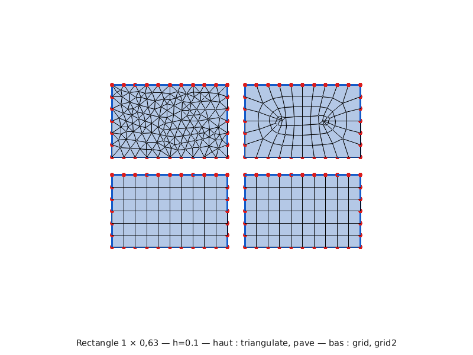

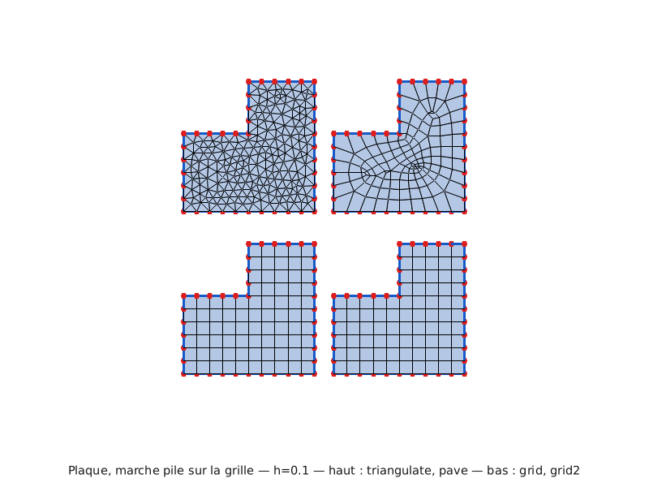

| forme | | triangulate | pave | grid | grid2 |
|---|---|---:|---:|---:|---:|
| rectangle 1 × 0,63 | mailles | 286 | 98 | **60** | **60** |
| | pire | 0,425 | 0,465 | **0,999** | **0,999** |
| plaque, marche sur la grille | mailles | 394 | 138 | **80** | **80** |
| | pire | 0,489 | 0,290 | **1,000** | **1,000** |

Les deux mailleurs en grille rendent le maillage qu'on dessinerait à la main :
toutes les mailles sont des rectangles et il n'y a pas un seul triangle. Le
paveur, lui, rend une pelure d'oignon avec quatre coutures diagonales — sa
faiblesse est là où deux de ses rangées se rencontrent, et cette ligne-là existe
même sur un rectangle.

### Une forme rectilinéaire qui ne tombe pas sur la grille

Dès que les cotes ne sont plus des multiples de la taille visée, `grid_surface`
et `grid_surface2` se séparent nettement.

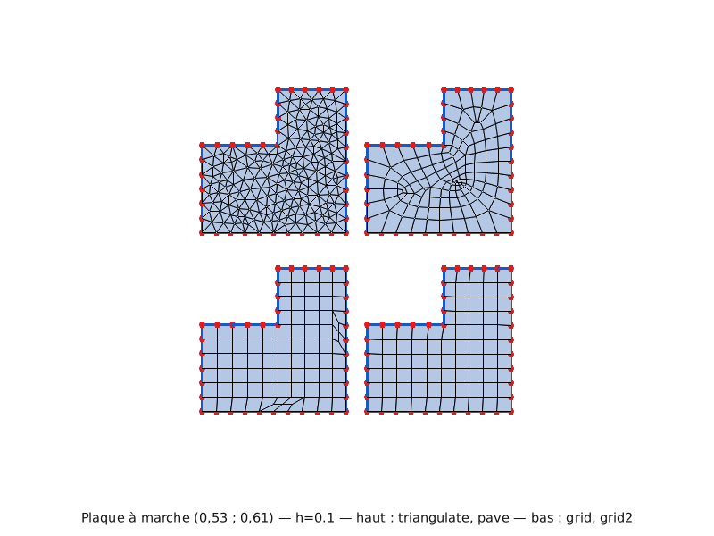

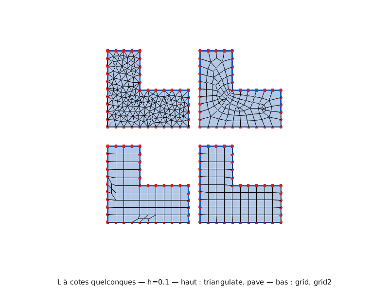

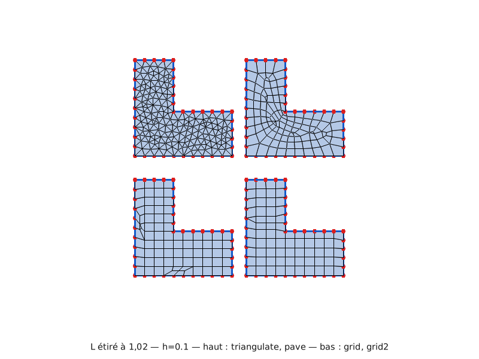

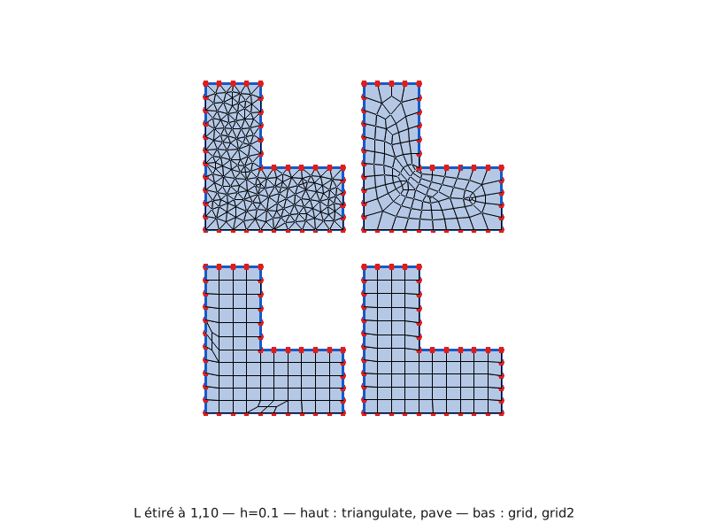

| forme | | triangulate | pave | grid | grid2 |
|---|---|---:|---:|---:|---:|
| plaque à marche (0,53 ; 0,61) | mailles | 366 | 138 | 86 | **80** |
| | pire | 0,481 | 0,187 | 0,405 | **0,963** |
| L à cotes quelconques | mailles | 308 | 118 | 76 | **70** |
| | pire | 0,459 | 0,401 | 0,437 | **0,979** |
| L étiré à 1,02 | mailles | 319 | 120 | 81 | **74** |
| | pire | 0,477 | 0,396 | 0,307 | **0,606** |
| L étiré à 1,10 | mailles | 336 | 123 | 80 | **74** |
| | pire | 0,474 | 0,398 | 0,421 | **0,963** |

`grid_surface` pose une ligne sur la coordonnée où repose chaque côté aligné,
puis découpe entre deux lignes d'après le côté qui les enjambe : toutes ses
lignes sont droites. `grid_surface2` donne à chaque nœud du contour la ligne qui
le traverse et laisse ses rangées **plier** pour aller chercher le contour — une
même rangée peut alors rejoindre deux parois qui se font face à deux hauteurs
différentes, ce qu'aucune droite ne sait faire.

Le L étiré à 1,02 est le seul de la série que `grid_surface2` ne règle pas :
les deux côtés y posent un nombre de nœuds **différent** sur la même portée,
dix contre onze, et aucune disposition de lignes n'invente la rangée manquante.
Le remède est dans le contour, pas dans le mailleur — voir
[la règle de discrétisation](operateurs/maillage.md).

### Un profil à sept angles rentrants

Le profil crénelé est décliné en deux versions dont **seule la base change** :
coupée sous chaque barre, ou d'un seul tenant. C'est le meilleur révélateur de
la sensibilité d'un mailleur à la discrétisation du contour.

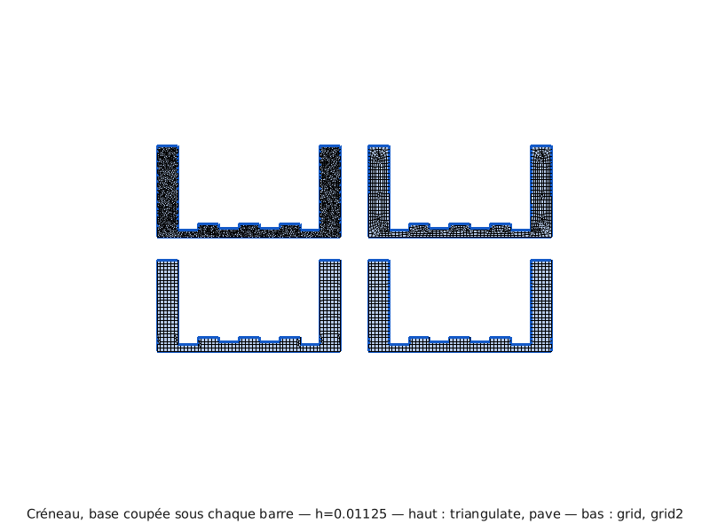

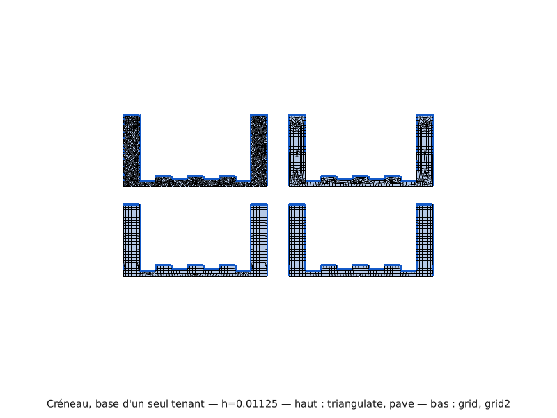

| forme | | triangulate | pave | grid | grid2 |
|---|---|---:|---:|---:|---:|
| base coupée | mailles | 2 050 | 871 | 474 | **456** |
| | pire | 0,412 | 0,327 | 0,382 | **0,916** |
| base d'un seul tenant | mailles | 2 089 | 872 | 487 | **456** |
| | pire | 0,419 | 0,326 | 0,287 | **0,651** |

`grid_surface2` rend **exactement le même nombre de mailles dans les deux cas**.
Les trois autres paient la base d'un seul tenant. C'est la propriété la plus
utile de ce mailleur : il pardonne une discrétisation de contour que les autres
font payer.

### Une forme oblique ou courbe

Ici le classement s'inverse, et c'est le seul endroit où il le fait.

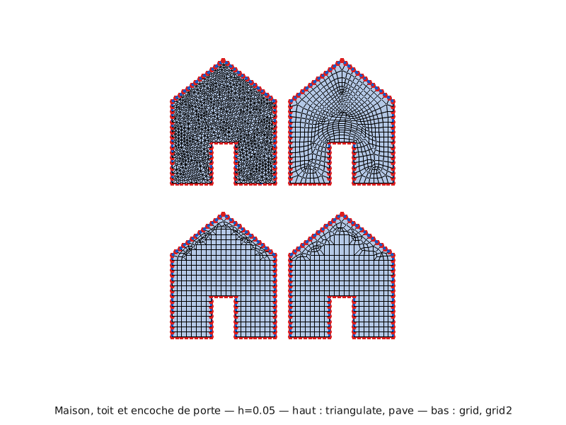

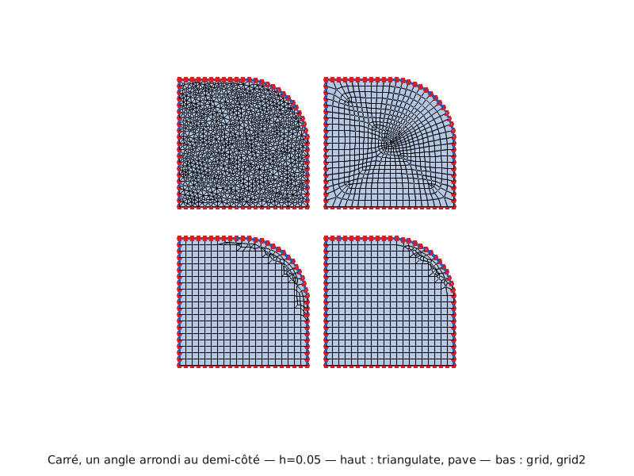

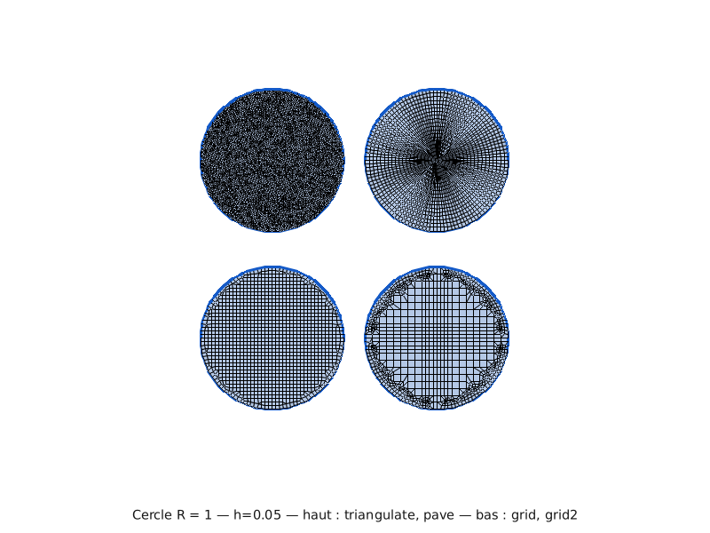

| forme | | triangulate | pave | grid | grid2 |
|---|---|---:|---:|---:|---:|
| maison | mailles | 1 723 | 621 | 477 | **415** |
| | pire | 0,484 | **0,491** | 0,304 | 0,479 |
| carré arrondi | mailles | 1 866 | 678 | 445 | **420** |
| | pire | **0,474** | 0,360 | 0,266 | 0,308 |
| cercle R = 1 | mailles | 6 114 | 2 339 | 1 260 | **1 132** |
| | pire | **0,424** | 0,031 | 0,288 | 0,344 |

Une grille ne peut pas suivre une oblique : elle la découpe en escalier, et tout
ce qui s'en approche est rendu au paveur frontal. Sur la maison, le pavage
épouse les deux pentes du toit et l'emporte d'un cheveu ; sur le cercle,
`triangulate_surface` est le meilleur des quatre.

Le cercle mérite un mot de plus. `pave_surface` y tombe à **0,031** — ses
rangées se rejoignent au centre en une étoile à quatre branches, et c'est cette
ligne-là qui porte tout le défaut. `triangulate_surface`, lui, ne descend jamais
sous 0,42, sur aucune des onze formes : c'est la signature d'un Delaunay
raffiné, qui garantit un angle minimal et rien de plus. Il ne s'effondre jamais,
mais il ne monte jamais non plus.

### Ce qu'il faut retenir

**Le coût en mailles est le classement le plus stable, et il ne s'inverse
jamais** : `grid_surface2` ≤ `grid_surface` < `pave_surface` <
`triangulate_surface`, avec un facteur quatre entre les extrêmes à qualité au
moins égale sur toute forme rectilinéaire. Pour un calcul, c'est le facteur qui
compte juste après la qualité.

En pratique :

- **forme rectilinéaire** — `grid_surface2`, et d'autant plus si ses côtés
  n'ont pas été coupés aux angles qui leur font face ;
- **forme courbe ou franchement oblique** — `triangulate_surface` si la qualité
  du pire élément commande, `pave_surface` s'il faut des quadrangles ;
- **quadrangles obligatoires** — `pave_surface` accepte `all_quad=True` et
  refuse par une erreur claire un contour dont la parité l'interdit ;
- **triangles voulus** — `triangulate_surface`, seul à en produire par
  construction.

### Deux limites connues

**Les rangées à deux fois la moyenne.** `grid_surface2` prend l'écartement de
ses lignes sur le contour ; là où le contour ne dit rien — le triangle du toit
de la maison, qu'aucune paroi verticale ne borde — il comble le vide en le
coupant en deux jusqu'à ce que l'intervalle ne dépasse plus deux fois la
moyenne. Quand ce vide vaut une puissance de deux fois la moyenne, la coupe
atterrit **exactement** sur deux fois : dix mailles de la maison sortent ainsi
deux fois plus hautes que les autres. C'est la borne haute admise, et la
corriger en coupant d'emblée en parts égales a été essayé — le maillage empire,
parce que ces rangées supplémentaires ne servent qu'à être érodées par
l'oblique et morcellent le travail du front.

**Le cercle est un objectif instable.** Sur une forme sans direction dominante,
déplacer la grille d'un millième change la pire maille du simple au décuple. Les
chiffres du cercle ci-dessus sont justes mais ne se prolongent pas : ne réglez
aucun paramètre dessus.

### Reproduire les figures

```bash
maturin develop --features extension-module,viz
python examples/comparer_mailleurs_2d.py

# Figures du livre :
PYRUCAST_IMG_DIR=book/src/img python examples/comparer_mailleurs_2d.py
```

Le script tient dans une fonction : elle prend un contour, le duplique trois
fois par `translate`, maille chaque copie par une méthode et réunit le tout sur
une figure.

```python
{{#include ../../examples/comparer_mailleurs_2d.py:comparer}}
```

## Mailler en 3D

À venir.
